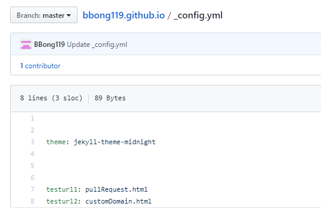
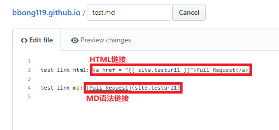
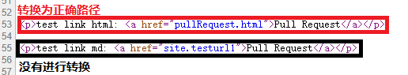

Back to [home page](README.md)  
Edit please visit: [Global Link](https://github.com/BBong119/bbong119.github.io/blob/master/globalVariableLink.md)   
  
  
  
**可以实现方便更改链接**

GitHub Pages其实是利用Jekyll讲静态文本转换为网页的。关于Jekyll的具体功能要了解的话可能还要仔细看一下。  
这边实现方便的链接是利用Jekyll的一个全局配置文件_config.yml来实现的。  

具体步骤如下([Test Link](test.md))：
- 定义Url变量在_config.yml中  
  
- 在md文件中使用html标签和配置文件中的变量名来链接    
  
- 在生成的网页中则会把这个变量转换成对应的Url实现链接  
  

Further Information：
- md文件自己的语法无法用配置文件中的变量名进行链接和转义，需要配合html标签使用。
- url的定义只能写GitHub转换后html文件路径，不能直接写md文件路径。  
（即库里的md文件在经过GitHub转换后会生成对应的html文件，但定义中的不会。所以在用相对路径进行链接的时候，要注意链接到转换后的html文件，绝对路径链接则没有这个问题）
